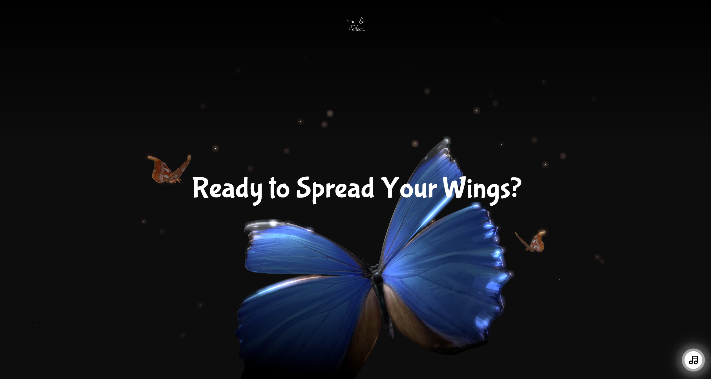

# Sparkle Butterfly: Unleash Your Creativity and Soar ✨

[](https://sparkle-butterfly.vercel.app/)

**Sparkle Butterfly** is an interactive landing page that invites you to embark on a captivating journey of transformation and creative exploration. Witness a mesmerizing dance of blue and orange butterflies as they flit through a starry nightscape, their movements echoing the limitless potential within you.

## Key Features:

- **Metamorphosis Magic**: Witness a beautifully rendered butterfly model transform and come alive with smooth animations powered by React Three Fiber.
- **Interactive Experience**: User interaction triggers captivating animations and visual effects, creating a personalized and immersive journey.
- **A Nighttime Canvas**: A sleek black background sets the stage for the vibrant blue and orange butterflies, accentuated by sparkling effects.
- **Soundscapes that Captivate**: PositionalAudio creates a captivating background music experience, further enhancing your exploration.

## Built With

- [Next.js](https://nextjs.org/) (Frontend Framework)
- HTML & CSS (Structure and Styling)
- JavaScript (Interactivity)
- [Tailwind CSS](https://tailwindcss.com/) (Utility-First CSS Framework)
- [React Three Fiber](https://docs.pmnd.rs/react-three-fiber/getting-started/introduction) (3D Graphics Library)
- [React Three Drei](https://github.com/pmndrs/drei)
- [React Postprocessing](https://docs.pmnd.rs/react-postprocessing/introduction)
- Gltfjsx (3D Model Integration)
- [React Intersection Observer](https://react-intersection-observer.vercel.app/?path=/docs/intro--docs)
- [GSAP](https://gsap.com/) (Animation Library)

## Getting Started

To get a local copy of this project up and running, follow these steps:

### Prerequisites

Make sure you have Node.js installed.

### Installation

Clone the repository and install dependencies.

```bash
git clone https://github.com/DV192/sparkle-butterfly.git
cd sparkle-butterfly
npm install
```

### Usage

Start the development server.

```bash
npm run dev
```

Visit http://localhost:3000 in your browser.

## Project Inspiration

This project was created by following the tutorial on [Reece Sugars YouTube Channel](https://www.youtube.com/@reecedevs). Special thanks to the creator for the guidance and inspiration.

## Deployment

This project is deployed on [Vercel](https://vercel.com/). Visit the live version [here](https://sparkle-butterfly.vercel.app/).
